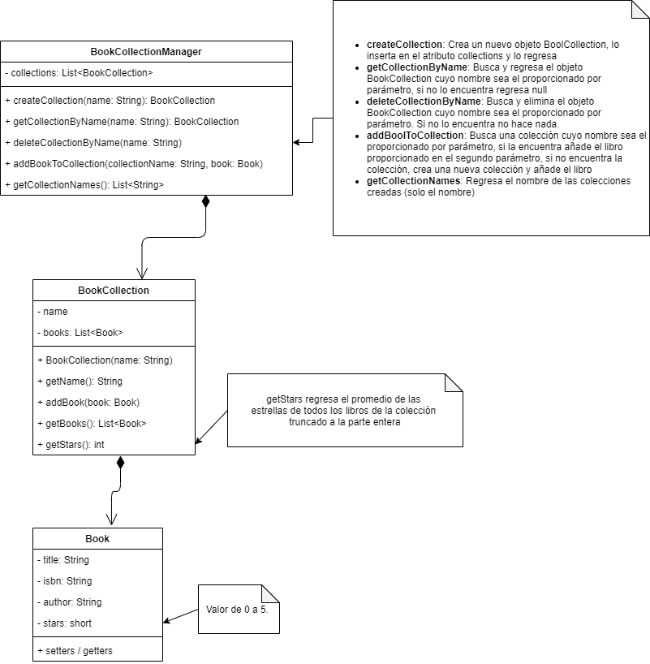

# Primer examen parcial 1

1. Hacer fork de este repositorio
2. Clonar el proyecto desde sus propias cuentas
3. Implementar las clases indicadas en el  
4. Ejecutar el main
5. Hacer push al repo de su propia cuenta
